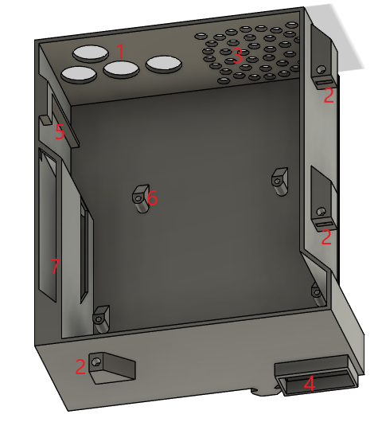
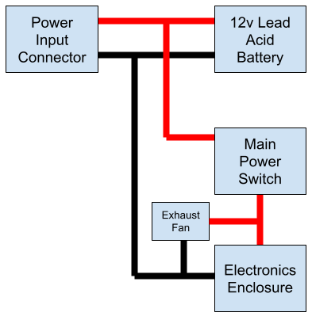

# Electronics Assembly
## Water Auto Turret Controller Board Assembly
The PCB has been designed to be relatively easy to assembly - only two surface mount components have been used - solenoid driver DRV8806 (only available in surface mount) and the power connector to join to the VIM3 (was easier to buy the khadas VIN to VIN Cable and solder this power connector on than it was to crip the cables to go into the connector on the VIM3!). Both these surface mount components can be hand soldered but the DRV8806 also has a thermal pad underneath it that means its easier to solder this with paste and hot air but it can be done with past and a soldering iron as there are a number of vias through to the VSS plane on the rear of the board. The power connector can just be tacked on one pin then aligned and then the rest can be soldered. The rest of the components are through hole and can be assembled in the normal size based order paying attention to orientation of polarised devices like diodes and capacitors. All components go on the top side of the board apart from the 40pin header socket that goes on the under side of the board to allow it to join to the VIM3 - I added this header after the surface mount components we soldered on to allow easy access to the pins for soldering. The TMC5160 breakout boards are mounted in pin header sockets for easy insertion / removal as two of the mounting screws are under these boards. This also has the added benefit of providing more space for mounting components and some resistors that were originally missed off have been mounted under them. Pay attention to the way these are mounted on the main board - the motor outputs (labeled A1, A2, B1 and B2), but do not mount them yet as the board needed to be assembled into the Electronics Enclosure first.

A few errors were found in the rev 1 Water Auto Turret Controller Board that needed modifications to be made - these were fixed in the rev 2 PCB and are listed below for information:
* SPI chip select was driven by an AND gate as i mistakenly believed you needed to use the CS pin that was part of the SPI port on the VIM3 for controlling CS and so the design had this CS pin (pin 15) wired into one input on each AND gate in a dual AND gate chip with two other GPIO pins used to drive the other inputs on the AND gates, with one motor controller on each of the AND gate outputs. The intention of using the GPIO pins to select which AND gate output would become active when the CS pin was activated. Having started coding it turns out this was completely not needed and I could just use the GPIO pins as the SPI CS pins directly. The rev 1 board was modded to break the link to Pin 15 and just pull these two inputs to +3v3, effectively making the AND gates pass through for the other GPIO pin levels. The rev 2 board removed this AND chip and linked the SPI CS on the motor drivers directly to the GPIO pins (WiringPi pin 7 or physical GPIO pin 23 for the pitch motor and WiringPi pin 6 or physical GPIO pin 22 for the yaw motor).
* Added pull up resistors to the REFL and REFR pin on both the motor controller boards that were missed off in the original design
* Added header for plugging in the enclosure fan 
* Added pull up resistor for the charging input sense line - the microcontroller has weak internal pull ups but option for external pull up added as well in case its needed
## Electronics Enclosure Assembly 
Refer to the Equipment Breakdown Structure for the items required to assemble the electronics enclosure.
### Camera Enclosure 
The first part to prepare is the 3D printed {02 Camera Enclosure}. The diagram below shows this part. 

First on the Camera Enclosure is to insert the 4 M3 square nuts into the slots marked 1 and press them home until the threads in the nuts line up with the holes above them. Ive found the easiest way to do this is to use needle nose pliers to hold them and push them part way in and then adjust grip and push them flush with the edge of the pliers. 

Next up is to mount the Khadas OS08A10 8MP HDR Camera itself. This should fit easily with the lens poking through the big round hole and the cable coming out the back of the Camera Enclosure (at the end near the hole marked 3). To fix the camera in place use M2x16mm screws in the two holes marked (2) and an M2x6mm screw in the hole marked (3).

On the other side of the Camera Enclosure the 25x25x3mm acrylic window (sourced from an online laser cutting service) and {03 Camera Enclosure Window Frame} need to be fitted. The acrylic window is put into place, glue is added round the frame to make a waterproof seal (super glue can be used but beware of frosting of the window) and then the window frame is added over the top to finish the look off.

This is the Camera Enclosure finished.

### Electronics Enclosure Base
The diagram below shows the 3D printed {00 Electronics Enclosure Base}. The area marked 7 is the air plenum - before assembly ensure that this area is free of support material. There should be none due to the design with the use of max 45 degree angles but it is easiest to clear now if any are present.

First insert the 4 grommets into the holes in the Electronics Enclosure (1) - this can be a bit fiddly to get them in but they do fit! Next insert the square nuts into the slots (2) in the 3 lid fixing points. Next the fan is added - it is mounted on the internal face ensuring that the air flow direction is exhausting out of the case. Fix the fan in place using 4 M4x14mm screws from inside the enclosure to 4 hex nuts on the outside. Align the wire so that it be easily routed over the opposite corner of the enclosure as this is where the header is to plug it in - note that this will have to route over top of the controller board once it is installed as there are no gaps between the controller board and the edge of the case. Attach a pin header socket to the end of the wire from the fan (trimming to length if needed), the fan for the turret base also needs to be crimped into this connector and so the wire needs to be pulled through one of the grommets before crimping in.

Next it’s time to prep the Khadas VIM3 - note that it is easiest to do the basic OS setup and the required image must be flashed before installing in the case, otherwise the serial debug link has to be used as there is no access to the USB-C or ethernet ports when it's in the Electronics Enclosure. See the Software Setup for this initial configuration.

On the VIM3 remove the bluetooth antenna as it is not needed. Next install the heatsink and fan as per the instructions. And finally plug one end of the VIN to VIN cable into the socket on the bottom of the VIM3 (on the opposite side of the PCB to the USB-C port). WIth these items in place now take the Camera Enclosure and align it so that cable from the camera goes through the slot in the Electronics Enclosure Base (4). Now the cable from the camera can be plugged into the MIPI-CSI socket on the bottom of the VIM3 ensuring the orientation is as per the picture [here](https://docs.khadas.com/linux/vim3/MIPICamera.html) and being careful not to put too much stress on the cable as they can tear relatively easily when not completely flat and the cable has a gentle bend in to fit in this design. The VIM3 can now be placed in the Electronics Enclosure Base with the mounting holes lined up with the supports in the base (6) - again being careful of the camera cable in this step. Next the heatsink insulator and spacers are added (yellow items in the following diagram). It can be useful to use a dab of superglue on the spacers to hold them in place during assembly.

With these items in place the Water Auto Turret Controller Board can be plugged into the VIM3 by mating the 40 way GPIO header on the VIM3 and the socket on the bottom of the Water Auto Turret Controller Board. This can be relatively tricky and again be careful of the camera cable in this step. Once assembled then both boards are screwed into mounting points (6) on the Electronics Enclosure base using 4 M2x18mm screws. To aid installation the Water Auto Turret Controller Board PCB will be approximately flush with the the front (side near (4)) and left (side near (7)) side of the Electronics Enclosure Base. Once installed then the VIM3 Wifi antenna can be pushed into its mounting hole (5). The TMC5160 breakout boards can now be installed. Pay attention to the way these are mounted on the main board - the motor outputs (labeled A1, A2, B1 and B2).

With this assembly complete both the Electronics Enclosure Base and Camera Enclosure can be slid into the Turret Base front panel making sure that the parts that slide into the extrusions are lined up so that the Camera Enclosure fits into the gap in the top middle of the front panel. With the Camera Enclosure pushed all the way home it should be slightly below the top of the extrusions. The Electronics Enclosure Base should be pressed as close to the Camera Enclosure as possible so that the lip on the top of it (4) sits inside the bottom of Camera Enclosure. Correct positioning can be checked by test fitting the Electronics Enclosure lid and making sure all screws line up with the nuts in the Electronics Enclosure Base and Camera Enclosure.

### Wiring
The wiring for the Water Auto Turret is pretty straight forward, just need to follow it through in sequence and double check connections. The image below shows the connector locations on the Water Auto Turret Controller Board for ease of reference during assembly. When measuring wiring it is useful to allow it to be long enough for the front panel of the turret base to be laid flat in front of the turret to allow for ease of assembly / maintenance.

#### Solenoids
The solenoid valves need connections to each coil, but the polarity does not matter so does not have to be tracked. The solenoid valve connections are designed for push on spade connectors, but they can also be soldered on if required. These wires need to be long enough to reach J5 and J6 on the controller board - it does not matter which solenoid joins to which connector and both connectors have the same pinout - pins 1 and 2 are for one solenoid and pins 3 and 4 are for the other. The wires from the solenoid should be threaded through the grommet and then have ther ends crimped into the pins which are then inserted into the connector housing. Getting the correct crimp tool and make this much easier but it can be done with needle nose pliers with practice!

#### Limit Switches
There are 4 limit switches used in the design, 2 for the yaw motor (mounted inside the turret base) and 2 for the pitch motor (mounted on the barrel mount). Again polarity does not matter. The yaw limit switches join to connector J8 and the pitch limit switches join to connector J9. The pinout for both these connectors is the same with pins 1 and 2 for the left reference input and pins 3 and 4 for the right reference input. I found it helpful to wire the switches up so that on the yaw the left switch is triggered when the barrel is at its left most extreme when looking from the back of the turret (similar for the right switch) as this then aligns with the perspective from the camera. The pitch ones matter less so wire however makes sense. 

One end of the limit switches wires are soldered to the normally open microswitch connections and then routed through the turret in such a way that they will not get tangled in any moving parts (I used sticky back cable tie holders and cable ties for this job), in through one of the grommets (I shared a grommet between the motor wiring and the limit switches for that motor but it doesn't really matter) and then the other ends are crimped into pins and inserted into the connector housing. 

The wiring from the pitch limit switches (along with the wiring for the pitch motor) needs to be routed down one of the non-water carrying pipes that join onto the barrel. This is simply done by cutting a slit in the tube and passing the cables down before routing internally as above.
#### Motors
The stepper motors already have connectors on, however the wiring is too long and so these connectors can be cut off to make for easier routing and installation. 

The wiring from the pitch motor needs to be fed down one of the pipes (as above with the microswitches) and then routed internally, then through one of the grommets, crimped into pins, inserted into the connector housing and then connected to J11. The pinout for this connector is pin 1 and 2 for coil 1 and pin 3 and 4 for coil 2. The polarity of the coils and which coil is on which set of pins does not matter. If it is not known which wires from the motor join to which coil then this can be discovered using a multimeter - with the two wires for a coil giving a low resistance and wires for unrelated coils giving open circuit. 

The wiring for the yaw motor is just routed internally and joined onto connector J10. The pinout for this connector is the same as J11. 
#### Indicators 
Next up is to connect up the dual colour LED and the charging sense wire from the power and water inlet 3D printed part. 4 wires are used to link these items, 3 wires for the 3 pins on the LED and one wire linked to the sleeve shunt on the power inlet connector (this sleeve shunt is normally connected to the sleeve (i.e. 0v) until a power connector is plugged in at which point this becomes open circuit and so allows detection of the charging plug being inserted). These wires need to be routed internally again, through the grommet and onto J3. The pinout for this connector is 1 - Green LED, 2 - Red LED, 3 - LED common, 4 - power sense
#### Power Wiring
The final wiring needed is to wire up the power cabling. Relatively thick cable has been used to carry the currents present in the system with the stepper motors and solenoids all potentially powered at the same time. The diagram below shows the connections required.

The power input connector is used to allow charging of the battery when it is installed in the enclosure. The exhaust fan is used to prevent buildup of gasses inside the enclosure when charging - its after the power switch to allow it to be turned on and off, the sense wire in the electronics prevents the system from being used when the battery is charging.

All power wires have terminals crimped onto them to allow connections to be made. Where there are two power wires joined (e.g. wires from the power input connector to the battery and to the mains power switch) then the terminals on the battery are used to stack them as there is the most room there. The following are the termination types for each cable:
* Power Input Connector (solder) => 12v Lead Acid Battery (ring terminal) {both red and black}
* 12v Lead Acid Battery (ring terminal) => Main Power Switch (spade terminal) {red}
* 12v Lead Acid Battery (ring terminal) => Electronics Enclosure (ring terminal) {black}
* Main Power Switch (spade terminal) => Electronics Enclosure (ring terminal) {red}
* Exhaust fan - crimped into the same connector as the fan for the Electronics Enclosure.
### Testing
Once all the wiring has been completed then the system can be powered up for a test to ensure it all works before fixing the lid. The sequence following engaging the main power switch should be as follows - green led will come on, red led will light, relay will click then the VIM3 fan will be heard to start, after a time for bootup it should be possible to log-in to the VIM3. The motor homing test software can then be run to test the motor and limit switch connections. Then the solenoid test software can be run to test those connections. If everything works then shutdown the VIM3 and power off, if not then check connections and repeat until it is all functioning correctly.
### Electronics Enclosure Lid 
Once all testing is complete and passed then the final step is to add the lid. The Electronics Enclosure Lid (see diagram below) simply needs some O-ring to be fixed in place in the grove (1) around the inside edge. I simply used green threadlock to hold this in place as I had it, but any glue that wont attack the rubber O-ring can be used. Once the O-ring glue is set then the lid can be placed on the Electronics Enclosure. The screws used to fix the lid in place are as follows 3 M3x20mm (2), 2 M3x50mm (3) and 2 M3x35 (4) inserted from the opposite side to shown in the diagram below.

## Final Assembly 
With all the components now wired in the battery can be slid into place in the turret base and the battery side support can be put in place using three horizontal to vertical profile joiners and two M5x8mm screws into the bottom of it through the baseplate. 

The Turret Base front panel can now be installed. The {06 Top Front Edge} needs to be put on the top of the front panel and then the front panel can be offered up to the rest of the Turret Base and then can be screwed in with 6 M5x8mm screws through the baseplate. 

That completes the assembly of the Water Auto Turret!
