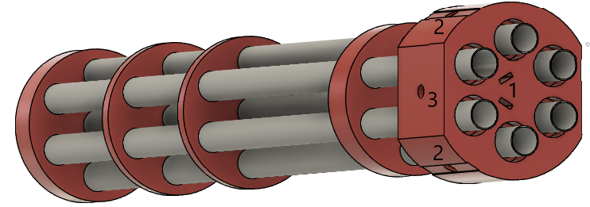
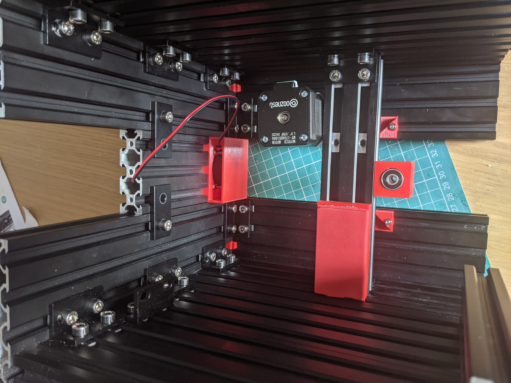

# Mechanical Assembly

There are a number of sub assemblies to construct that are then assembled into the overall water turret. There is no fixed order that these sub assemblies need to be built in however we are going to start with the Internal Bearing and Motor Mount. There are separate Fusion360 models for each of these sub assemblies to aid assembly. 3D printed parts has been {} to allow for easy identification e.g. {00 Bearing Mount}

## Internal Bearing and Motor Mount
Refer to the Equipment Breakdown Structure to identify the list of part required for this sub assembly.

The diagram below shows the major items and how they fit together for the internal bearing and motor mount.

First take the {00 Bearing Mount} and insert the two M3 square nuts into the slots on the top and push down until the thread of the nut is aligned with the holes for the two M3x25mm screws that are on the front. This should simply require pushing the nuts down as far as they will do with a suitable tool, e.g. needle nose pliers. Once pushed in the insert the M3x25mm screws but not far enough to protrude from the Bearing Mount on the shape that slides into the aluminum extrusion. These screws are for locking the Bearing Mount in place against the extrusion to prevent it moving and so will be tightened in a later step. Next insert the two 625ZZ bearings into the round holes on the top and bottom of the Bearing Mount.These should be tight friction fits and if they are not then a dab of glue can be used to hold them in place (remembering not to get any in the bearing itself).

The Bearing Mount is then slid onto one side of the 20x40x150mm aluminum extrusion and positioned exactly in the middle - there should be 76mm either side of the {00 Bearing Mount} to the ends of the extrusion. Getting this exactly in the middle is important as this bearing holds the yaw shaft for the barrel. Once it is in place then tighten the M3x25mm screws in the front of the Bearing Mount until there is strong resistance to the part moving in the extrusion but not too tight or they may crack the 3D printed part. Once the screws are tightened then re-measure to make sure the Bearing Mount is still in the exact centre of the extrusion.

Next slide the {01 Battery Top Spacer} into right hand underside of the aluminum extrusion. The end of the Battery Top Spacer should be flush or slightly in from the right hand end of the extrusion. To aid holding the battery in place a rectangle of 2mm foam needs to be cut and stuck to the underside of the Battery Top Spacer.

The motor now needs to be mounted on the left hand side of the extrusion on the opposite side from the Bearing Mount. First slide two tee nuts into each slot on the extrusion, then place the NEMA17 Motor Bracket over the extrusion and line up the holes in it and the tee nuts in the extrusion. Next use M5x8mm screws to losely bolt the bracket into place. Next use M3x6mm screws to attach the NEMA17 Motor to the bracket. Next the 16 Tooth, 5mm bore, 2GT Pulley is mounted on the shaft of the motor - this should be mounted near the top of the shaft on the motor and be screwed in tight noting that this may need to be adjusted during final assembly.

Two tee nuts need to be inserted one in each of the (bottom) slots in the aluminum extrusions. These are to join the battery front support onto at a later stage of assembly.

The last two items to be fitted are the brackets to join this subassembly to the rest of the turret base - these are not shown in the diagram above. These are two slot, 90 degree brackets. One is fitted on each side the left hand side bracket is fitted under the profile and the right hand side are fitted above the profile. Both are fitted in the same manner - two tee nuts are slid into the profile (one in each slot in the profile), the bracket is placed on top and loosely screwed into place using M5x8mm screws. The brackets will need to be adjusted in the final assembly but need to be tight enough to stop them falling off at this stage!

## Barrel Assembly
Refer to the Equipment Breakdown Structure to identify the list of part required for this sub assembly.

The diagrams below shows the major items and how they fit together for the barrel. A front and rear view is provided to show all the key features.

Assembly of the barrel starts with the {00 Base} 3D printed part. First two M3 square nuts are inserted into the slots (1) then M3x10mm screws are screwed into the two holes (2). These screws are to lock the barrel on the shaft that goes through the hole in the side (3) and so these screws must not be screwed in too far at this point or it will be impossible to insert the shaft. 

Next to be added is the central plastic barrel (324mm) which must be inserted as far as possible into the base noting that this does not protrude out the other side of the base. Following this two of the outer barrels (380mm) can be inserted into the base on opposite sides of the central barrel. These outer barrels need to protrude 10mm from the back base to provide support to the flexible tubing when it is attached. Once these outer barrels are installed then the barrel rings can be installed, {01 Ring 3} is installed first, then {02 Ring 2}, then {03 Ring 1} and then {04 End Cap}. In the design above the following spacings are used for the rings (measured from the edge of the base nearest the rings to the bottom of the other rings):
* Ring 3 - 45mm
* Ring 2 - 185mm
* Ring 1 - 250mm
* End Cap - 318mm
These spacings are not essential so can be adjusted for how the builder wants to make the barrel look. Once the rings are in place the remaining barrels can be worked into place. Depending on the tolerances of the 3D printer used the use of a rubber mallet may be required to get them all in place!

Once the barrels are all in and adjusted to be level then the nozzles can be fitted. In the current build 3 blank nozzles are fitted in the centre, top and bottom most barrels and the right and left barrels have different size nozzles. The nozzles are simply fixed in place with hot glue, squirt some round the underside of the mating side of the nozzle and push it home. The excess can then be trimmed.

## Barrel Mount Assembly 
Refer to the Equipment Breakdown Structure to identify the list of part required for this sub assembly.

The diagram below show shows the barrel mount assembly with the motor cover removed to show assembly. The first step is to join the two base aluminum extrusions (20x80x150mm both ends tapped and 20x20x15 untapped) together using the two profile joiner pieces which are simply slid into the holes in the profiles. 

Next two tee nuts for mounting the motor to are slid into each of the 2nd and 4th extrusions (top side) slots in the base created above and one right angle hidden corners to support the uprights are slid into each side in the centre extrusion (top side) slot. Two tee nuts are slid into the centre extrusion (bottom side) slot in preparation for attaching the Barrel Rotary Attachment.

The side T-pieces are then screwed into the base profiles using 3 M5x10mm screws in each T-piece. Two tee nuts need to be slid into the 1st and 5th extrusion (bottom side) slots in preparation for attaching the rotary bearing. The {06 Extrusion End Cap} can be fitted onto 3 of the corners and one {07 Extrusion End Cap - Named} can be fitted to the remaining corner (or an additional plain one can be used if preferred). 

The upright extrusions (20x20x90mm one end tapped) are then screwed into place by sliding the upright half of the hidden corner bracket into one side of the profile (with the tapped hole facing upwards) and then sliding it and the bracket over to be flush with the T-piece. Two tee nuts are then inserted into the upright on the side nearest the T-piece and screw in place using M5x8mm screws. Once the screws on the T-piece are in place then the hidden corner bracket grub screws can also be tightened to lock the upright in place. This can then be repeated for the upright on the other side. 

The {04 Barrel Microswitch Mount - Front} and {05 Barrel Microswitch Mount - Rear} need to have one M3 square nut pushed into each of them and one M3x14mm screws can be screwed into each until it is just before the edge touching the profile. They can now be slotted onto the left hand upright and pushed down until approx 2mm below the top of the extrusion paying attention to which is the front and which is the rear. They should be installed as per the diagram below. The microswitches can now be mounted into these with the levers pointing upwards. A dab of glue can be used to hold them in place if needed. The M3x14mm screws can now be tightened down to hold them in place.

The {00 Left Bearing Housing} and {02 Right Bearing Housing} can then be placed on the supports and screwed on with M5x10mm screws. Two 625ZZ bearings are then installed into each of the bearing housing - these should be friction fits but a dab of glue can be used if required to hold them in place. The {00 Left Bearing Housing - Cap} and {02 Right Bearing Housing - Cap} can then be installed on the top of the bearing housings. 

The NEMA23 motor bracket slotted holes need to be widened out using a file to allow for M5 screws and then is screwed down to the base using low profile M5x8mm screws in such a way as to roughly centre the motor on the base with hole for the motor shaft being to the right. These should be tightened to lock this in place. The NEMA23 motor is then screwed into the bracket using 4 M4x10mm screws and 4 M4 hex nuts, ensuring that the wire for the motor comes out the rear  allowing it to be fed through the hole in {11 Top Motor Cover}. The 18 tooth, 6.35mm bore GT2 pulley is put on the motor shaft and tightened in place using its grub screws. Double sided tape can then be put on the top of the motor and the Top Motor Cover can be put in place and pressed down to make it stick to the double sided tape.

On the underside of the base the Barrel Mount Rotary Attachment can now be fitted - this piece provides the clamping mechanism to join the yaw shaft onto the barrel mount. First the {08 Barrel Mount Rotary Attachment} is prepped by putting one M3 square nut into each of the holes on the top and pressing them in until the threads line up with the holes from the sides. One M3x12mm screw is then put in from each side and screwed in until just before the ends enter the central hole (for the yaw shaft). The Barrel Mount Rotary Attachment can now be loosely screwed to the underside of the Barrel Mount using M5x12mm screws mated with the tee nuts that were inserted earlier. The {09 Barrel Mount Rotary Attachment - centre spacer} can then be used to exactly align the Barrel Mount Rotary Attachment in the centre of the barrel mount base by using this to go between the end of the extrusion and the Barrel Mount Rotary Attachment itself. Check this on both sides and once aligned screw down tight but not too tight or the 3D printed part may crack. Next up is the add the yaw shaft itself. A 105mm length of 5mm hardened steel rod is required - to cut this something like a tungsten carbide blade will be required and to put the suggested flat spots on it then diamond dust files work well. ~10mm wide flat spots are suggested to be added to the shaft ~40mm from the bottom end and on the top end to allow better grip for the clamping screws. The top end can then be inserted into the Barrel Mount Rotary Attachment and then evenly tightening the two M3x12mm screws  to grip the shaft in the centre of the mounting hole. Onto the yaw shaft the {12 Limit Switch Arm - Internal} and a 60 tooth, 5mm bore GT2 pulley also need to be installed, with the limit switch arm (approx 45mm from the end of the shaft) first then the pulley (approx 30mm from the end of the shaft). Both these items should be installed loosely as they will need adjustment later.  

The final step for assembly of the barrel mount is to attach the rotary bearing. This also attaches on the underside of the barrel mount. The holes in this bearing are not large enough so need to be drilled or filed out to fit M5 screws. This is screwed into place using low profile M5x8mm screws which mate into the tee nuts that were inserted earlier into the 1st and 5th extrusions. It is essential to get the rotary bearing centred on the base again so loosely tighten the bearing, then measure to make sure it is central, tighten up and then measure again to make sure it is still central. 

## Turret Base Assembly

The turret base is where all the mechanical parts come together to make an overall system. A number of 3D printed parts need to have other parts assembled into them first before they are incorporated so we will start with these. 

### Water and Power Inlet  
This 3D printed part {09 Water and Power Inlet} has a number of parts mounted in and behind it. This part can be found in the diagram below.

First up the extra plastic material need to support printing has to be removed from holes 1 and 4. The holes on the front are the smaller holes so work from the front to clear these holes out - there is only a 0.2mm layer of plastic so this should be straight forward. Also remove any support material that may be found down the parts that slide into the aluminum extrusions and slide this part in and out of an extrusion a few times to make sure of a good and easy fit before populating it with the other parts. 

After this the power inlet connector can be installed. The O-ring should be placed over the connector and then the connector can be inserted from the rear through hole (1), the protective cover can then be put over the connector thread (with the actual protective cover hanging down into the gap at the bottom (near hole (4)) and then the nut can be screwed down until tight. The metal washer in the pack is not used. 

The LED is installed next - it may be easier to wire the LED before installing to make the soldering easier - see the Electronics Assembly section for more information. This is simply pushed into hole (4) from the rear. A dab of glue can be used if required to secure it.

The main power switch is installed next. This installed from the rear though hole (2) with the nut/protective cover being installed from the front to hold the switch in place.The terminals of the switch need to be carefully bent upwards until they are flat with the bottom of the switch to avoid them fouling the battery when it is installed.

Lastly the solenoid valve assembly is inserted into hole (3) and is fixed in place using two M4x16mm screws through the smaller holes above and below the main inlet. Once mounted in place the G3/4 to hosepipe adaptor can be screwed onto the inlet thread. It may be easier to measure and mount the wires for the solenoids at this point - see the Electronics Assembly section for more information.

### Fan Inlet
The {00 Fan Inlet} only has a fan mounted in it but it can be tricky to get this mounted! A diagram of the part can be found below, it is shown upside down in this picture so that the fan can be easily seen. The outside part of this piece will be the visible side (with holes in it )

The fan is inserted from via the hole in the hole on the outside part. But before putting the fan in the cable for the fan must be fed through the hole for this purpose by the top right hand edge of the fan in the diagram (hole not visible). Once the cable has been pulled through to the other side then the fan can be dropped in and fixed in place using M4x20mm screws from the front with M4 hex nuts on the rear. The screws can be accessed via the holes in the front of the fan inlet and it is suggested to start with the lower nuts on the back (held in place with pliers) to make assembly easier. Once the fan is fixed in place then the four {01 Fan Inlet Hole Cover} parts can be pushed into place in the four holes on the front of the unit to aid in waterproofing. 

### Rotary Bearing Mount
The {04 Rotary Bearing Mount} provides the interface point between the Turret Base and the Turret Barrel Mount. The four holes nearest the middle need to be cleaned out from the plastic used to support the printing - this can be easily done by pushing an M5 screw through each hole from the top. This part can now be attached to the rotary bearing (that was joined to the base of the Turret Barrel Mount in a previous step). M5x12mm hex head screws are used to do this via the inner 4 holes. The hex head screws are inserted from the underneath and then the rotary bearing is fixed in place with half height M5 hex nuts. The screw locations on the bottom of the Rotary Bearing Mount have a hex outline to allow for easy assembly. 

### Turret Base Top Plate and Plumbing
This part holds all the tubing between the water control solenoids and the turret barrel. It is much easier to assemble the tubing into this top plate before assembling the top plate into the overall turret base. The photo below shows the final tubing assembly. First from the braided hose cut two 130mm lengths, two 65mm lengths and six 45mm lengths. This hose needs to be able handle mains pressure water and thinner more flexible hose will likely be pushed off the connectors (as I found out!). Two identical pairs of hoses need to be constructed. One pair is made from two 45mm lengths joined with a 90 degree tube elbow, with one of the 45mm lengths joined onto a 3D printed {07 Tubing Adaptor} and all the joints secured with hose clips (behind the barbs) as shown. The other pair is made from a 3D printed {07 Tubing Adaptor} joined onto a 130mm length with the other end joined to a 90 degree tube elbow which is also joined to a 65mm length which is in turn joined to a 45mm length with another 90 degree tube elbow, and all the joints secured with hose clips (behind the barbs) as shown.

Six 320mm lengths of corrugated hose are then required four of which are securely glued into the tube adaptors using a liberal amount of epoxy glue worked well into recess for the tube to push into and ensuring the tube goes past the small internal barb in the tube adaptor to help keep the tube in place. Note that this end of the tube adaptor has four thin plastic supports to help with printing these adaptors - these can be easily removed with side cutters before inserting the tubes in. Once the tubing has been left long enough to let the epoxy set firm the tubes can be inserted through the Turret Base Top Plate taking care to insert the tubes that are going to be used for water in the correct holes to line up with the barrel - in the design as built this is the outer four holes with the centre two reserved for dummy tubes.

### Turret Base 
The main part of the turret base is assembled from aluminum extrusions held together with 3D printed profile joiners and 2 hole joining plate brackets and double L shaped brackets. Other 3D printed parts slot into these aluminum extrusions to complete the turret base. The rear/side view of the Turret Base can be found below to aid with assembly.

First assemble the two sides; these are each simply made from three 20x80x220mm aluminum extrusions held together with four 3D printed profile joiners, one at each end of each join to make a stack of three aluminum extrusions. 

Now the rear can be assembled. This is assembled by taking one 20x80x240mm (tapped at the bottom end) extrusion and sliding the fan inlet onto one edge and aligning it with the top of the extrusion noting that the fan inlet hole covers show the outside of the unit. Underneath this fan inlet join a 20x60x90mm extrusion to the same side at the fan inlet using two 3D printed profile joiners and push up flush under the fan inlet, noting that the protrusions under the fan inlet will lock into the gaps in the top of this extrusion. Under this slide in the Water and Power Inlet and again push flush with the extrusion above, again engaging the protrusions in the extrusion. Lastly add a 20x60x40mm extrusion (tapped at the bottom end) using 2 more 3D printed profile joiners and push home. Now on the other side of the items that have just been installed another 20x80x240mm (tapped at the bottom end) extrusion can be slid on using 4 more 3D profile joiners to firmly attach this part. 

The top can now be assembled. This starts with a 20x80x220mm extrusion into which is slid the Turret Base Top Plate. This top plate is aligned against one end of this extrusion, on the other end of the extrusion is a 20x60x30mm extrusion held in place with a 3D printed profile joiner. The gap that is left between the two is where the Rotary Bearing Mount will go but this has to be assembled later to allow the yaw shaft to be inserted into the internal bearing mount. Now another 20x80x220mm extrusion is slide on the side of the Turret Base Top Plate and shorter extrusion, again joined with a 3D printed profile joiner. 

The sides and front can now be joined together using seven double universal L brackets, twenty six tee nuts and twenty six M5x8mm screws as shown in the photo below - note that this photo is taken with the turret base upside down and with the water and power inlet and top plate / tubes removed for ease of photography. Note the bracket on the lefthand side in this photo facing the other way - this is to support the back side of the battery when it is installed. 

Once the sides and front have been joined then the top can be added and fixed in place two double universal L brackets, eight tee nuts and eight M5x8mm screws as shown in the photo below. Before fixing the top on the {05 Top Rear Edge} part must be put between the extrusions and slotted into place as shown in the diagram above. This part is impossible to add once the top has been screwed in place. 

Once these parts have been screwed together then the pipework can be attached to the solenoid valves outlet pipes, noting that hose clips need to be used on all these joins (behind the barbs on the solenoid value outputs as before). The long tubes with double 90 degree bends join to the bottom outlets and the shorter tubes join to the top outlets. It is quite a tight fit to get all this pipework in and the cable clips tightened up and a flexible shaft hex driver really helps to get the hose clips tightened up.

Next to install is the Internal Bearing and Motor Mount. To install this insert two tee nuts in the second extrusion slot down on the right hand side (looking from the front - see the diagram below) and two tee nuts in the fourth extrusion slot down on the left hand side and then insert the Internal Bearing and Motor Mount (motor first) and line the L brackets on the end of them with the cage nuts that have just been placed in the extrusions and loosely screw them in place so that the Internal Bearing and Motor Mount can be slid back and forth in the turret base, as an initial positioning it will go about a third of the way back.

The Barrel Mount and Rotary Bearing Mount assembly can now be offered up to the hole in the top of the Turret Base. The 252mm GT2 timing belt must be put around at least the yaw shaft, and ideally positioned around the pulleys before it is located in the bearings. The Rotary Bearing Mount must be pushed flush with the Turret Base Top Plate. The yaw shaft needs to go through the centre of the bearings in the bearing mount and so the Barrel Mount and Rotary Bearing Mount assembly needs to be moved back and forwards until it is in a suitable location. Once in place then the Rotary Bearing Mount needs to be screwed down to the top of the Turret Base using four M5x12mm hex head screws and four tee nuts slid into the extrusion slots 3rd out from the edges of the top. These screws can be done up by rotating the turret barrel mount out of the way to allow access. After checking that the Rotary Bearing Mount is still flush with the Turret Base Top Plate these screws can be tightened down. Now the screws in the L brackets that join the Internal Bearing and Motor Mount to the sides of the Turret base can be tightened down progressively checking for continued free yaw rotation of the barrel mount as they are tightened. Once these are tightened then timing belt can be installed over the two pulleys, the pulleys can be adjusted to they are in a plane with each other and the yaw motor can be adjusted and tightened down so that the timing belt is tight between the two pulleys - it should be possible to push the timing belt in slightly in the middle but with minimal deflection. 

Next the yaw microswitches can be installed into the {02 Internal Limit Switch Holder - Left} and {03 Internal Limit Switch Holder - Right}. An M3 square nut can be installed in each of them and an M3x12mm screw inserted into each until just before it comes out the other side of the profile insert. The microswtich holders can then be inserted into the 4th slot in from each side on the Turret Base top. The locking screws should be nearest the front (where the microswitches have been slid in from) and the microswitch levers should point towards the back of the Turret Base. The Limit Switch Arm can now be adjusted to be the right height to activate the microswitches. With the turret barrel mount pointing directly forward the limit switch arm must point directly towards the back of the unit. The locking screw can now be tightened to hold it in place. 

The front battery support post (20x40x180mm tapped at the bottom end) can now be added using a double L shaped bracket to fix it to the bottom of the Internal Bearing and Motor Mount using the tee nuts that were placed in an earlier step and two M5x8mm screws. The side battery mount will be fixed in place later once the batter has been added.

The baseplate can now be added. 4 tee nuts need to be slid into the bottom edge extrusion slot on both sides and the baseplate is fixed in place using sixteen M5x8mm screws (6 for the rear, 4 for each side and 2 for the front battery support post).

Last to build is the front of the turret base ready for the installation of the Electronics Enclosure and Camera Housing. Take one 20x80x240mm (tapped at bottom end) extrusion and join one side to a 20x60x210mm (tapped at bottom end) extrusion using two 3D printed profile joiners, then add another one 20x80x240mm (tapped at bottom end) extrusion onto the other side of the 210mm extrusion using two more 3D printed profile joiners. Ensure that the tapped holes are all at the bottom and that the 30mm gap for the Camera Housing is at the top. Some 2 hole brackets can be used with tee nuts and M5x8mm screws if required to add some rigidity to the front panel. The front panel will be populated and installed as part of the electronics assembly.  
 
### Turret Barrel Installation
The last of the mechanical assembly is to install the Turret Barrel. A 150mm length of 5mm hardened steel rod is required as the pitch shaft, which can be cut and worked as before. A flat side should be made along the whole length of this shaft leaving 22mm each end untouched to allow for locking on the various components on the shaft in place. Starting from the right hand side (looking from the front) and with the flat side on the shaft facing directly downwards pass the shaft through the two bearings in the housing then put a 202mm GT2 timing belt between the pulley on the motor and a 40 tooth, 5mm bore GT2 pulley positioned so that the locking grub screws are towards the middle away from the bearing housing then insert the pitch shaft into this pulley (note this will be tight fit as there is no other adjustment for this belt). Next add the Barrel itself and push the pitch shaft through it, then add {10 Limit Switch Arm - Barrel} with the flat edge facing away from the barrel. Lastly push the pitch shaft through the other two bearings to complete the installation of the barrel. With the shaft in place the components can all be adjusted to their final positions. Starting with the barrel - this needs to be placed in the middle of the two uprights - exact isn’t essential but will help with more accurate tracking and firing - then the two locking screws can be tightened up. The pulley can then be adjusted so that it is in a plane with the pulley on the motor and its grub screws can be tightened and lastly the limit switch arm can be adjusted and locked in place with its locking screw. The limit switch arm should be in the middle of the two limit switches when the barrel is pointing roughly parallel. Epoxy can be added to help ensure it stays in the correct position. 
